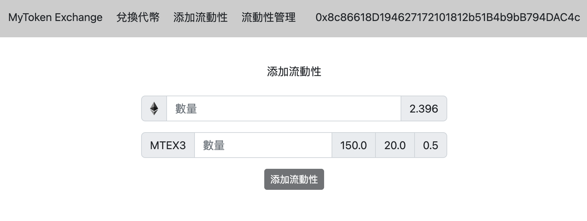
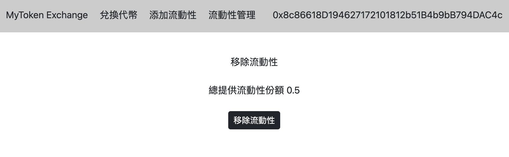
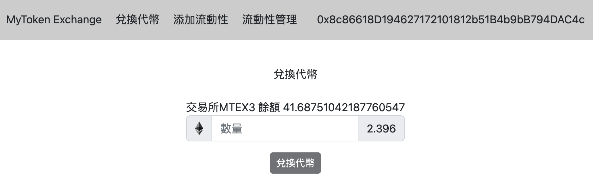
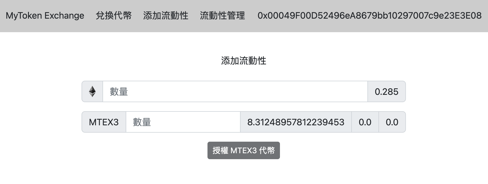

# MyToken Exchange Implementation

## AMM 去中心化自動造市商交易所實踐開源

### Rinkeby 合約

#### 代幣合約

[MyTokenEX3](https://rinkeby.etherscan.io/address/0xd63f40227B9CEd07482ceaD26A2bC66f214fEc10)

#### 流動池合約

[Exchange](https://rinkeby.etherscan.io/address/0x1b4161853f39048c47c28496f2c362ec925c48e9)

### 功能

- 授權代幣
- 添加流動性
- 移除流動性
- ETH 兌換代幣

### 介面圖片

添加流動性

移除流動性

兌換代幣

其他人兌換代幣

## 使用框架

[WAGMI](https://github.com/madeinfree/wagmi-nft-fronend-booster)

## LISCENSE

MIT
